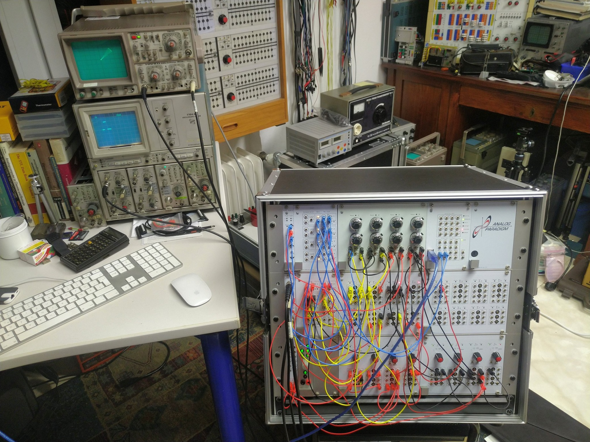

## ANALOG-CARTPOLE - A hybrid analog/digital computing experiment

Use digital Reinforcement Learning to learn to balance an inverse pendulum
on a cart simulated by a Model-1 by Analog Paradigm (http://analogparadigm.com)

Analog part done by vaxman on 2019-07-27
Digital part done by sy2002 on 2019-07-27

TODO: Write a better README.md

