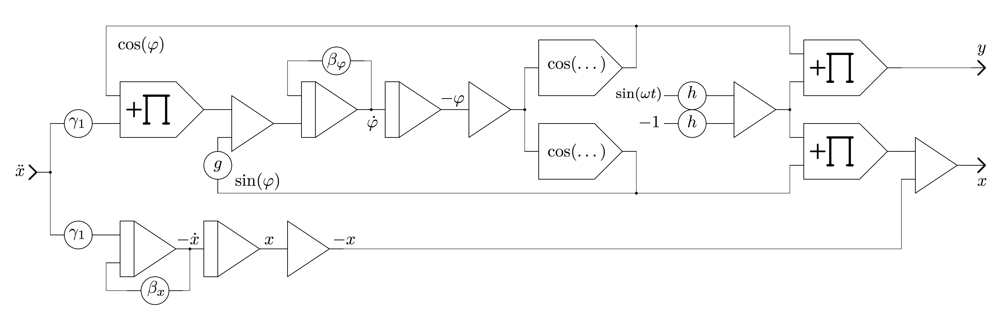

## ANALOG-CARTPOLE - A hybrid analog/digital computing experiment

Use digital Reinforcement Learning to learn to balance an inverse pendulum
on a cart simulated by a Model-1 by  
Analog Paradigm (http://analogparadigm.com)

Done in July to September 2019. Analog part by [vaxman](http://www.vaxman.de).
Digital part by [sy2002](http://www.sy2002.de).

Watch a short introduction to this experiment on YouTube by clicking the
image below or by using this link:   
[https://youtu.be/jDGLh8YWvNE](https://youtu.be/jDGLh8YWvNE)

One of the classical "Hello World" examples of Reinforcement Learning is
the inverse pendulum. A pole is mounted on a cart. The cart can move in one
dimension, for example to the left or to the right. The center of mass is
located above the pivot point as shown in the following image:

A force is applied to move the cart to the right and to the left to keep
the pendulum upright. Important parameters of this system are: the position
of the cart, the velocity of the cart, the angle of the pole and
the angular velocity.

For training your reinforcement learning algorithms,
[OpenAI Gym offers a simulation](http://gym.openai.com/envs/CartPole-v1/)
of a simplified version of this model that delivers exactly these
four parameters for your control algorithm and that expects that you keep
applying impulses from the left or from the right to keep the pole upright.

In our experiment, we used a Model-1 from Analog Paradigm to create an
analog version of OpenAI Gym's simulation. Here is our setup:

You can see Model-1 on the right side. The algorithm (shown below) is wired on
the Model-1 using the black, blue, yellow and red cables. On top of Model-1,
there is an oscilloscope that shows the output of some training episodes of
the reinforcement learning algorithm. On the left is a Mac, on which a Python
script runs the reinforcement learning and which uses Model-1's Hybrid
Controller to send commands from the digital computer to the analog computer.

The oscilloscope on the right shows the control actions of the Python script:
A bar in the middle means "controls nothing" but "calculates and learns". A
bar on top means push cart to the right and a bar on the bottom means push
cart to the left.

### Analog simulation of the inverse pendulum

Lorem ipsum dolor sit amet, consetetur sadipscing elitr, sed diam nonumy
eirmod tempor invidunt ut labore et dolore magna aliquyam erat, sed diam
voluptua. At vero eos et accusam et justo duo dolores et ea rebum. Stet
clita kasd gubergren.

Duis autem vel eum iriure dolor in hendrerit in vulputate velit esse molestie
consequat, vel illum dolore eu feugiat nulla facilisis at vero eros et
accumsan et iusto odio dignissim qui blandit praesent luptatum zzril delenit
augue duis dolore te feugait nulla facilisi. Lorem ipsum dolor sit amet.

At vero eos et accusam et justo duo dolores et ea rebum. Stet clita kasd
gubergren, no sea takimata sanctus est Lorem ipsum dolor sit amet. Lorem ipsum
dolor sit amet, consetetur sadipscing elitr, sed diam nonumy eirmod tempor
invidunt ut labore et dolore magna aliquyam erat, sed diam.

### Digital reinforcement learning using the analog computer

Toggle between analog computer and OpenAI Gym. Serial communication. 
Q-Learning algorithm.

Lorem ipsum dolor sit amet, consetetur sadipscing elitr, sed diam nonumy
eirmod tempor invidunt ut labore et dolore magna aliquyam erat, sed diam
voluptua. At vero eos et accusam et justo duo dolores et ea rebum. Stet
clita kasd gubergren.

[analog-cartpole.py](analog-cartpole.py)

Duis autem vel eum iriure dolor in hendrerit in vulputate velit esse molestie
consequat, vel illum dolore eu feugiat nulla facilisis at vero eros et
accumsan et iusto odio dignissim qui blandit praesent luptatum zzril delenit
augue duis dolore te feugait nulla facilisi. Lorem ipsum dolor sit amet.

At vero eos et accusam et justo duo dolores et ea rebum. Stet clita kasd
gubergren, no sea takimata sanctus est Lorem ipsum dolor sit amet. Lorem ipsum
dolor sit amet, consetetur sadipscing elitr, sed diam nonumy eirmod tempor
invidunt ut labore et dolore magna aliquyam erat, sed diam.

### Results

At vero eos et accusam et justo duo dolores et ea rebum. Stet clita kasd
gubergren, no sea takimata sanctus est Lorem ipsum dolor sit amet. Lorem ipsum
dolor sit amet, consetetur sadipscing elitr, sed diam nonumy eirmod tempor
invidunt ut labore et dolore magna aliquyam erat, sed diam.

Episode|Mean Steps|Median Steps|Min. Steps|Max. Steps|Epsilon|
-------|----------|------------|----------|----------|-------|
0|82.00|82.00|82|82|0.4545
20|81.75|61.00|34|217|0.4167
40|170.10|138.50|48|420|0.3846
60|351.80|256.50|48|1398|0.3571
80|633.35|477.00|95|2421|0.3333
100|589.35|387.00|39|2945|0.3125
120|4674.80|2825.00|14|19709|0.2941
140|3608.60|1708.00|105|14783|0.2778

Duis autem vel eum iriure dolor in hendrerit in vulputate velit esse molestie
consequat, vel illum dolore eu feugiat nulla facilisis at vero eros et
accumsan et iusto odio dignissim qui blandit praesent luptatum zzril delenit
augue duis dolore te feugait nulla facilisi. Lorem ipsum dolor sit amet.
