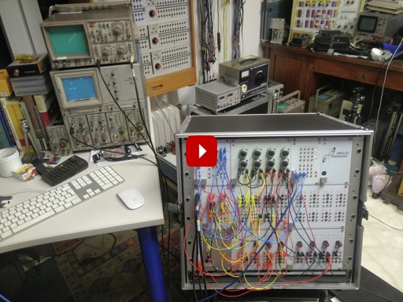
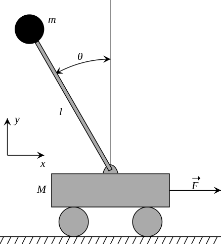
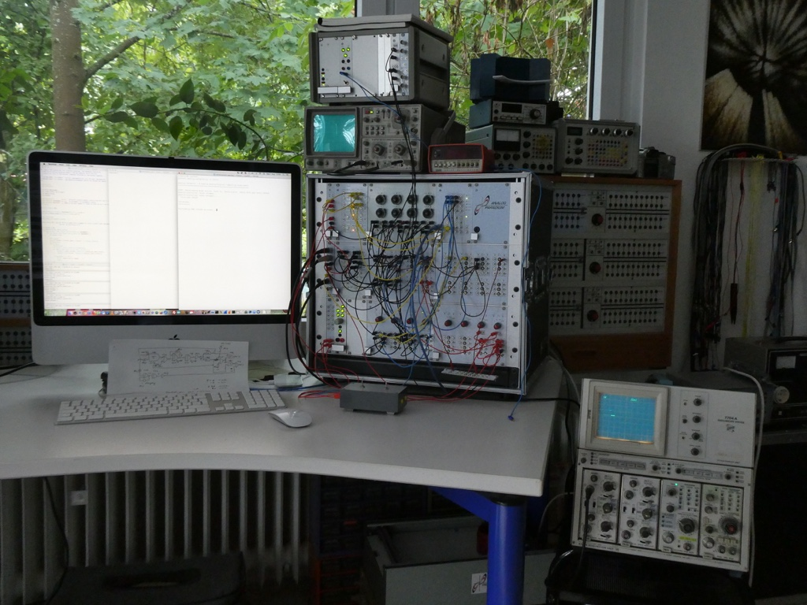
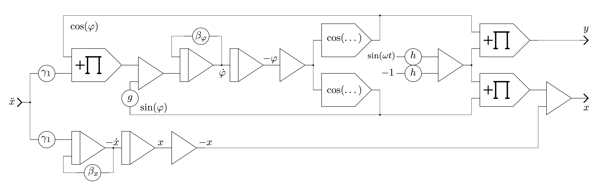
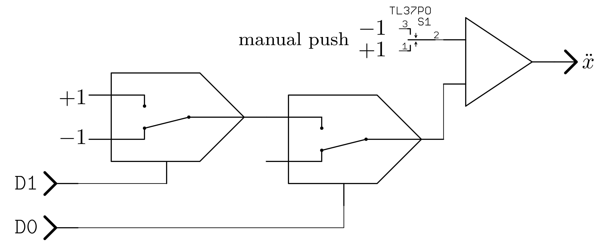

## ANALOG-CARTPOLE - A hybrid analog/digital computing experiment

Use digital Reinforcement Learning to learn to balance an inverse pendulum
on a cart simulated on a Model-1 by  
Analog Paradigm (http://analogparadigm.com)

Done in July to September 2019. Analog part by [vaxman](http://www.vaxman.de).
Digital part by [sy2002](http://www.sy2002.de).

Watch a short introduction to this experiment on YouTube by clicking the
image below or by using this link: https://youtu.be/jDGLh8YWvNE

[](https://youtu.be/jDGLh8YWvNE)

One of the classical "Hello World" examples of Reinforcement Learning is
the inverse pendulum. A pole is mounted on a cart. The cart can move in one
dimension, for example to the left or to the right. The center of mass is
located above the pivot point as shown in the following image:



A force is applied to move the cart to the right and to the left to keep
the pendulum upright. Important parameters of this system are: the position
of the cart, the velocity of the cart, the angle of the pole and
the angular velocity.

For training your reinforcement learning algorithms,
[OpenAI Gym offers a simulation](http://gym.openai.com/envs/CartPole-v1/)
of a simplified version of this model that delivers exactly these
four parameters for your control algorithm and that expects that you keep
applying impulses from the left or from the right to keep the pole upright.

In our experiment, we used a Model-1 from Analog Paradigm to create an
analog version of OpenAI Gym's simulation. Here is our setup:



You can see Model-1 on the right side. The algorithm (shown below) is wired on
the Model-1 using the black, blue, yellow and red cables. On top of Model-1,
there is an oscilloscope that shows the output of some training episodes of
the reinforcement learning algorithm. On the left is a Mac, on which a Python
script runs the reinforcement learning and which uses Model-1's Hybrid
Controller to send commands from the digital computer to the analog computer.

The oscilloscope on the right shows the control actions of the Python script:
A bar in the middle means "controls nothing" but "calculates and learns". A
bar on top means push cart to the right and a bar on the bottom means push
cart to the left.

### Analog simulation of the inverse pendulum

Programming an analog computer is quite different from programming a classic
stored-program digital computer as there is no algorithm controlling the 
operation of an analog computer. Instead, an analog computer program is a 
schematic describing how the various computing elements (such as summers,
integrators, multipliers, coeffizient potentiometers etc.) have to be 
interconnected in order to form an electronic model, an analogue, for the 
problem being investigated. 

At first sight this looks (and feels) quite weird but it turns out that it
is not only much more easy to program an analog computer than a digital 
computer as there is no need to think about numerical algorithms when it comes
to tasks like integration etc. Further, an analog computer is much more 
energy efficient than a digital computer since all of its computing elements
work in parallel without any need for slow memory lookups etc. Further, the
signals on which an analog computer simulation is based are continuous 
voltages or currents and not binary signals, so the super-linear increase of
power consumption as is typical for digital computers does not hold for analog
computers.

History background of analog computers can be found in this
[great book by Bernd Ulmann](https://www.amazon.de/Analog-Computing-Bernd-Ulmann/dp/3486728970/ref=sr_1_3).

A modern introduction to the programming of analog and hybrid computers is
described in
[this textbook](https://www.amazon.de/Analog-Computer-Programming-Gruyter-Textbook/dp/3110662078/ref=sr_1_6).

The schematic shown below is the analog computer setup to simulate an inverted
pendulum. The mathematic derivation can be found in
[this paper](http://analogparadigm.com/downloads/alpaca_20.pdf).



The picture below shows the subprogram controlling the moving cart by means of
a hybrid controller which couples the analog computer with a stored-program 
digital computer by means of an USB-interface. D0 and D1 depict two digital 
outputs of this controller and control two electronic switches by which the 
cart can be pushed to the left or to the right.



### Digital reinforcement learning using the analog computer

#### System architecture of the experiment

[analog-cartpole.py](analog-cartpole.py) represents the digital part of this
experiment. It is a Python 3 script that uses the good old
[serial communication](https://en.wikipedia.org/wiki/Serial_communication)
to control the analog computer. For being able to do so, the analog computer
[Model 1](http://analogparadigm.com/products.html) offers an analog/digital
interface called [Hybrid Controller](http://analogparadigm.com/downloads/hc_handbook.pdf).

In our experiment, Model 1's Hybrid Controller is connected to a Mac using a
standard USB cable. There is no driver or other additional software necessary
to communicate between the Mac and the Hybrid Controller. The reason why this
works so smoothly is, that the Hybrid Controller uses an FTDI chip to implement
the serial communication over USB. Apple added FTDI support natively from OS X
Mavericks (10.9) on as described in
[Technical Note TN2315](https://developer.apple.com/library/archive/technotes/tn2315/_index.html).
For Windows and Linux, have a look at the 
[installation guides](https://www.ftdichip.com/Support/Documents/InstallGuides.htm).

The bottom line is, that from the perspective of our Python 3 script, the
analog computer can be controlled easily by sending serial commands to the
Hybrid Controller using [pySerial](https://pypi.org/project/pyserial/).

#### Digital-only mode

If you do not have an Analog Paradigm Model 1 analog computer available, then
you can also run it on any digital computer that supports Python 3
and [OpenAI Gym](http://gym.openai.com/). For doing so, you can toggle the
operation mode of [analog-cartpole.py](analog-cartpole.py) by setting the
flag `SOFTWARE_ONLY` to `True`.

When doing so, we advise you to also set `PERFORM_CALIBRATION` to `True` as
this yields much better results on OpenAI Gym's simulation and you should set
`SINGLE_STEP_LEARNING` to `False` as single step learning is just a means of
compensating the slowness of the Python script in the "real world realm" of
analog computers.

#### Reinforcement Learning: Q-Learning

We apply [Reinforcement Learning](https://en.wikipedia.org/wiki/Reinforcement_learning)
to balance the CartPole. For doing so, the following four features are used to
feed a [Q-learning algorithm](https://en.wikipedia.org/wiki/Q-learning):
cart position, cart velocity, pole angle and the angular velocity of the pole's tip.

As Q-learning is a model-free algorithm, it actually "does not matter for the
algorithm", what the semantics of these four parameters/features mentioned above
are. It "does not know" the "meaning" of a feature such as "cart position" or
"angular velocity". For the Q-learning algorithm, the set of these features
is just what the current `State` within the `Environment` is comprised of.
And the `State` enables the `Agent` to decide, which `Action` to perform next.


If you are new to Q-learning, then
[this simple introduction](https://www.freecodecamp.org/news/an-introduction-to-q-learning-reinforcement-learning-14ac0b4493cc/)
might be helpful. But in contrast to this simple example, the feature space of
cart position, cart velocity, pole angle and angular velocity is pretty large:
Normalizing all of them to the interval [0, 1], and each state consisting
of these four dimensions will lead to an infinite amount of possible states.
Therefore a naive tabular or discrete approach to model the action
value function Q(s, a), will be far from optimal.

#### Implementation specifics

* The current state s is equal to the `observation` obtained by querying the
  analog computer using the function `env_step(a)` as shown
  [here](https://github.com/sy2002/ai-playground/blob/master/analog/analog-cartpole.py#L427).
  It consists of the cart position, cart velocity, pole angle and
  angular velocity represented as floating point numbers between 0 and 1.

* You can have an arbitrary amount of possible actions on an analog computer
  by applying different forces for different amounts of times to push the
  cart. We chose the following simplification: There are only two possible
  actions: "Push the cart to the left" and "push the cart to the right."
  Both are implemented by applying a constant force for a constant
  period of time. The strength of the force is hard-wired at the analog
  computer and the constant period of time is configured in the variable
  `HC_IMPULSE_DURATION`. The function
  [`hc_influence_sim`](https://github.com/sy2002/ai-playground/blob/master/analog/analog-cartpole.py#L210)
  shows, how the two possible actions `0` and `1` are translated into
  impulses that control the cart.

* We use
  [Linear Regression](https://en.wikipedia.org/wiki/Linear_regression)
  to model the action value function Q. For each action, there is one
  Linear Regression, so instead of having one action value function Q(s, a),
  we are having two value functions Q_a=0(s) and Q_a=1(s). The reason for this
  is that value functions are complex beasts and each simplification is
  welcome to increase the chance of fast and efficient learning.

* [scikit-learn](https://scikit-learn.org)'s Linear Regression class/algorithm
  [SGDRegressor](https://scikit-learn.org/stable/modules/generated/sklearn.linear_model.SGDRegressor.html)
  is used for the actual implementation. It conveniently offers a so called
  `partial_fit` function that is allowing us to perform online-learning. This
  is necessary, as the Q-Learning algorithm itself is among other things
  based on Dynamic Programming principles and therefore cannot provide batch
  data. Instead, after each step in each episode, we can refine our model
  of the Q function by calling our update function
  [`rl_set_Q_s_a`](https://github.com/sy2002/ai-playground/blob/master/analog/analog-cartpole.py#L447)
  that itself relies on `SGDRegressor`'s `partial_fit` function. Please note
  that SGDRegressor allows to specify a learning rate (alpha) upon
  construction so that the calculation of the Q update value can be
  simplified from 
  `new_value = old_qsa + alpha * (r + GAMMA * max_q_s2a2 - old_qsa)`
  to `new_value = r + GAMMA * max_q_s2a2`.

* The CartPole challenge itself can be solved by merely performing
  a dot multiplication of a vector with four wisely chosen values with a
  vector containing the four state variables (cart position, cart velocity,
  pole angle and angular velocity). But this is not the point of this
  experiement that wants to show that a general purpose machine learning
  algorithm like Q-Learning can be efficiently trainined using an analog
  computer as the environment simulation.
  Therefore it needs to be stated that the value functions Q_a=0(s) and
  Q_a=1(s) are much more complex (as they contain predictions for future
  rewards) than a mere control policy for the CartPole. And this is why we
  need a model that is complex enough to match this complexity.
  Our experiments have shown that Linear Regression using just four linear
  variables (such as the four state variables) is underfitting the
  data. 

This is why we decided to choose another way of representing the states: The
current state `s` shall be defined as the distance of the four features
(cart position, cart velocity, pole angle, angular velocity) to a big amount
of randomly chosen "example states" that we are calling `Exemplars` inside
[analog-cartpole.py](analog-cartpole.py). In other words, the `Exemplars` are
just an amount of `n` randomly chosen "situations" in which the CartPole could
be in, and a "situation" is a random instance of
(cart position, cart velocity, pole angle, angular velocity).
Therefore a state `s` is nothing else than the combined "similarity"
of `s` to all of the `Exemplars`.

The result of this approach is, that `s` is *not* represented as a four
dimensional vector of (cart position, cart velocity, pole angle, angular velocity).
Instead, we are doing a feature transformation from these four features
(i.e. 4-dimensional vector) to `n` `Exemplar`-distances, yielding an
`n`-dimensional vector.

This transformation gives us enough "resolution" (or in other words a sufficiently
large `n` dimensional space) that allows us, to use
 to find
the `Value Function`. We could not do this with a 4-dimensional
linear function, as it would not be able to model the complexity of CartPole's
Value Function and therefore the model would underfit.

The next challenge is, that we are not having all input variables available to
solve the Linear Regression in one step. Instead, Q-learning means stepwise
learning. Therefore it is very useful that
[scikit-learn](https://scikit-learn.org)'s Linear Regression class/algorithm
[SGDRegressor](https://scikit-learn.org/stable/modules/generated/sklearn.linear_model.SGDRegressor.html)
offers a `partial_fit` function that performs one epoch of stochastic gradient descent
on our given sample at a time. In our code, this is implemented in the function
`rl_set_Q_s_a`, which learns the next iteration of the `Value Function` for a
given action `a` in the current state `s`: It calls the `partial_fit` function of
SGDRegressor.

```
def rl_set_Q_s_a(s, a, val):
    rbf_net[a].partial_fit(rl_transform_s(s), rl_transform_val(val))
```
 
Linear functions are not able to model the non-linear behaviour of CartPole. That means
if we want to stick to Linear Regression as our means of "storing" Q-learning's results
(i.e. finding the `Value Function`), we need to add the non-linearity in another way:
This is why we chose to measure the distance betweeen the current "situation" of
(cart position, cart velocity, pole angle, angular velocity) to the `Exemplars`
by using non-linear Gaussian
[Radial Basis Functions](https://en.wikipedia.org/wiki/Radial_basis_function).
The shape of Gaussian Radial Basis Functions (RBFs) can be
defined using a parameter called epsilon, here are some examples:

 

scikit-learn offers a convenient class called
[RBFSampler](https://scikit-learn.org/stable/modules/generated/sklearn.kernel_approximation.RBFSampler.html).
The *epsilon* parameter mentioned above is called *gamma* there. The `transform` function of RBFSampler can be used
to transform (cart position, cart velocity, pole angle, angular velocity) to the `n` distances to the `Exemplars`
represented by the RBFSampler and the `n_components` parameter used in RBFSampler's constructor is exactly
the amount `n` we are talking about. In our code, `n` is called `RBF_EXEMPLARS` (250 by default).

To be sure we have enough variance and "resolution", we decided to use a whole bunch of RBFSamplers, each
of them using a different gamma parameter: The range goes from `RBF_GAMMA_MIN` (0.05 by default) to
`RBF_GAMMA_MAX` (4.0 by default) and we are instanciating `RBF_GAMMA_COUNT` (10 by default) RBFSamplers,
which are conveniently bundled in a [FeatureUnion](https://scikit-learn.org/stable/modules/generated/sklearn.pipeline.FeatureUnion.html).
The FeatureUnion, which we call `rbfs` in our code, allows us to call the `transform` function of
all those RBFSamplers within one function call and to collect the output in one 2,500 dimensional vector
(250 RBF_EXEMPLARS x 10 RBF_GAMMA_COUNT). The `rl_transform` function is doing exactly this:

```
# the RBF network is built like this: create as many RBFSamplers as RBF_GAMMA_COUNT
# and do so by setting the "width" parameter GAMMA of the RBFs as a linear interpolation
# between RBF_GAMMA_MIN and RBF_GAMMA_MAX
gammas = np.linspace(RBF_GAMMA_MIN, RBF_GAMMA_MAX, RBF_GAMMA_COUNT)
models = [RBFSampler(n_components=RBF_EXEMPLARS, gamma=g) for g in gammas]

# we will put all these RBFSamplers into a FeatureUnion, so that our Linear Regression
# can regard them as one single feature space spanning over all "Gammas"
transformer_list = []
for model in models:
    model.fit([[1.0, 1.0, 1.0, 1.0]]) # RBFSampler just needs the dimensionality, not the data itself
    transformer_list.append((str(model), model))
rbfs = FeatureUnion(transformer_list)     #union of all RBF exemplar's output

[...]

def rl_transform_s(s):
    if scaler == None:  # during calibration, we do not have a scaler, yet
        return rbfs.transform(np.array(s).reshape(1, -1))
    else:
        return rbfs.transform(scaler.transform(np.array(s).reshape(1, -1)))
```

We are not having one `Value Function` but two of them: One for each action `a`, that is possible in our
environment. And when it comes to decide, which action to take, our agent is looking for the highest
`Value Function` over all actions for a given state `s` and to decide which action `a` to take.
There are two actions possible: Push the cart from the left and push the cart from
the right. The two `Value Functions` are represented by the current approximation done by the
Linear Regression, this is why the list `rbf_net` is defined as a list of SGDRegressors and
why above-mentioned `rl_set_Q_s_a` function uses `rbf_net[a]`:

```
# List of possible actions that the RL agent can perform in the environment.
# For the algorithm, it doesn't matter if 0 means right and 1 left or vice versa
# or if there are more than two possible actions
env_actions = [0, 1] # needs to be in ascending order with no gaps, e.g. [0, 1]

[...]

rbf_net = [SGDRegressor(eta0=ALPHA, power_t=ALPHA_DECAY, learning_rate='invscaling', max_iter=5, tol=float("-inf"))
        for i in range(len(env_actions))]
```

In the analog world, a "push" is never something discrete. In contrast, to "push something into
a direction" is more like applying a force to something for a certain period of time. And this
is exactly what we do, when we "push" the cart, i.e. execute action `0` or action `1`.
The constant `HC_IMPULSE_DURATION` defines how many milliseconds the force shall be applied to
the cart when "pushing" it into a certain direction.

The Q-learning itself is implemented pretty straightforwardly. This README.md does not contain
an explanaton how Q-learning or Reinforcement Learning works, but is focused on the specific
implementation choices we made. So the following list gives only the high-level view on
our implementation of the Q-learning algorithm. More details can be found in
[Richard Sutton's and Andrew Barto's book](http://www.incompleteideas.net/book/RLbook2018trimmed.pdf).


1. Given the current state `s`: Decide with the probability of `EPSILON`, if we want to "exploit"
   (means "use") the currently learned `Value Function` to decide which action to take - or - if we'd
   like to "explore" other options (means choose a random action).
2. Perform the action `a`, get the reward `r` and enter state `s2`. (The state `s2` is the
   state that we arrive in, when we perform action `a` in state `s`.)
3. Get the next best action `a2` given our current state `s2` by greedily looking for
   the highest `Value Function` over all actions that are possible in `s2`.
4. Learn: Modify the `Value Function` for (`s`|`a`) by utilizing the highest possible
   rewards in the successor state `s2` after having performed action `a2` and respect
   the discount factor `GAMMA` and the learning rate `ALPHA`. 
5. If not done (i.e. the pole has fallen or the whole experiment runs a predefined amount
   of steps): Repeat and go to (1).

The following code snipped is abbreviated code from [analog-cartpole.py](analog-cartpole.py)
that implements the steps shown above. The function `rl_get_Q_s_a` that is used there has not been
explained, yet: It uses the Linear Regression algorithm SGDRegressor to output (aka "predict")
the currently learned version of the `Value Function` for a given pair (`s`|`a`). And `env_step`
is modifying the environment by performing action `a`; in our case this means: The cart is
recieving an impulse either from the left or from the right. Finally, `rl_max_Q_s` looks
for the next best action, given a certain state, and returns that action together with the
respective value of the `Value Function`.

```
while not done:
    # epsilon-greedy: do a random move with the decayed EPSILON probability
    if p > (1 - eps):
        a = np.random.choice(env_actions)

    # exploit or explore and collect reward
    observation, r, done = env_step(a)            
    s2 = observation

    # Q-Learning
    old_qsa = rl_get_Q_s_a(s, a)
    # if this is not the terminal position (which has no actions), then we can proceed as normal
    if not done:
        # "Q-greedily" grab the gain of the best step forward from here
        a2, max_q_s2a2 = rl_max_Q_s(s2)
    else:
        a2 = a
        max_q_s2a2 = 0 # G (future rewards) of terminal position is 0 although the reward r is high

    # learn the new value for the Value Function
    new_value = old_qsa + (r + GAMMA * max_q_s2a2 - old_qsa)
    rl_set_Q_s_a(s, a, new_value)

    # next state = current state, next action is the "Q-greedy" best action
    s = s2
    a = a2        
```

A last note that is not necessarily relevant for understanding how the algorithm works, but
that might still be interessting: Despite its name, the RBFSampler is actually not using
any RBFs inside. You can find
[some experiments and explanations here](https://github.com/sy2002/ai-playground/blob/master/RBFSampler-Experiment.ipynb)
to learn more about this.

### Results

The following table shows how the Python script running on a standard laptop
was able to leverage the real-time simulation of the analog computer to
learn quickly. After for example 120 episodes, the mean steps were already
at 4,674 and the maximum steps at 19,709 which is the equivalent of more
than 15 minutes of successful balancing per episode.

Episode|Mean Steps|Median Steps|Min. Steps|Max. Steps|Epsilon|
-------|----------|------------|----------|----------|-------|
0|82.00|82.00|82|82|0.4545
20|81.75|61.00|34|217|0.4167
40|170.10|138.50|48|420|0.3846
60|351.80|256.50|48|1398|0.3571
80|633.35|477.00|95|2421|0.3333
100|589.35|387.00|39|2945|0.3125
120|4674.80|2825.00|14|19709|0.2941
140|3608.60|1708.00|105|14783|0.2778
160|4826.75|1839.50|27|23965|0.2632          
180|3121.75|820.50|57|17782|0.2381          
200|2181.90|1281.00|33|9920|0.2273          
220|4216.50|1993.50|29|26387|0.2174          
240|3867.75|446.50|22|25592|0.2083          
260|6535.00|713.00|121|66848|0.2000          
280|4120.25|737.50|38|39596|0.1923          
300|4531.75|647.50|67|28202|0.1852          
320|5513.95|1434.50|24|33491|0.1786          
340|6595.30|1885.00|46|43789|0.1724    

The key to success was to minimize the latency introduced by the serial
communication between the digital and the analog computer, so that the
Q-Learning algorithm did not have to learn a lot about handling latency
in addition to learn how to balance the pole. This was done by leveraging
the Hybrid Controller's "bulk mode" that is able to transfer the whole
state (cart position, cart velocity, pole angle, angular velocity) in one go.

The result table also shows, that episode 260 yielded a very good "brain"
and after episode 260, there might have been
overfitting or other reasons for decreased performance. The Python script's
"enhanced persistence mode" (activated by the command line parameter `-SP`)
helps to find and store the right cutoff point for the learning because
it stores the current state of the "brain" every few episodes.
