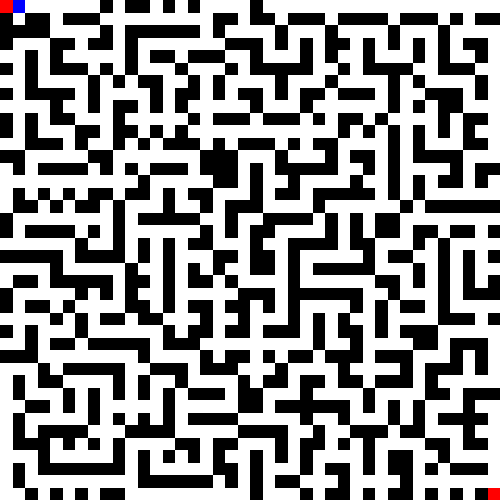

## Maze
Using Reinforcement-Learning to solve mazes of arbitrary sizes. Use the variables `mx` and `my`
in the Python code to configure the size. Here is a 20x20 example maze:

### Main Files

* ABC
* DEF

### Helper Files

* EFG
* HIJ